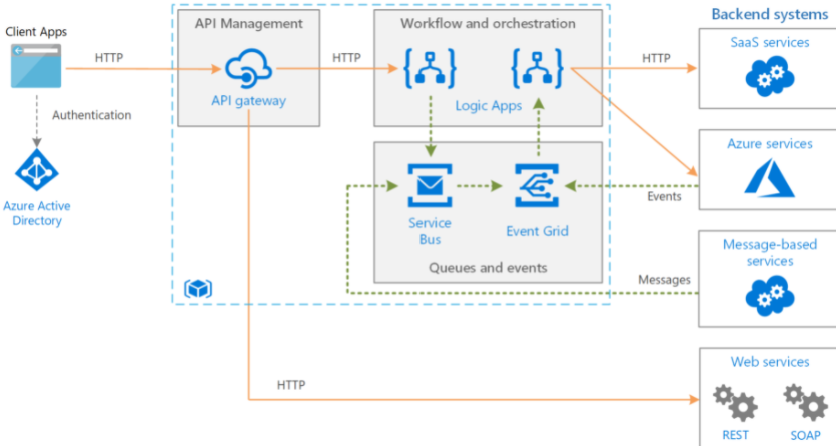
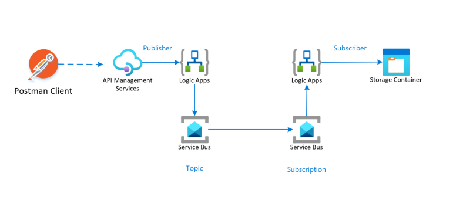
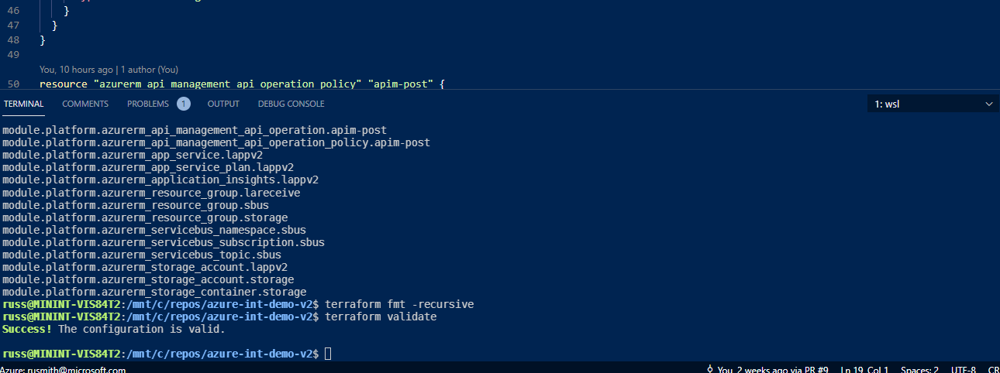

# Introduction

This repo contains a full azure integration services demo based on a Microsoft reference architecture.  It uses a full ci/cd process for development and deployment across multiple environments.


## Architecture
The implemented process follows the reference integration architecture found here:
https://docs.microsoft.com/en-us/azure/architecture/reference-architectures/enterprise-integration/queues-events


<br/>

Terraform is used to deploy the services either from the command line of from DevOps/GitHub pipelines.  The reference implementation uses DevOps.

## Implementation
### Overview
This demo implements the following services to represent the above architecture:


### Setup
Terraform requires configuration before it can be used in the recommended manner.  Example commands are included below showing how it can all be done from within VS Code. 
These commands are run in an ubuntu WSL session in a VS Code terminal window.

It is dependent on Terraform and Azure CLI being installed
The user must be logged in to azure first, run az login

Basic commands for building the environment:

1.  Build a terraform state store. 
    * Edit /tfstate/statestore.tf to use unique storage account names 
    * In the bash session, navigate to /tfstate
    ```bash
    terraform init    
    terraform plan -out=terraform.plan
    ```
    
2.  Build the base environment services (Log analytics, Key vault, empty APIM service )
    * The APIM service is included here because it takes 45 mins to provision and so no good for live demo.
    * It is assumed there will be 2 environments: prod and non-prod
    * Get your aad object id e.g 
    ```bash
    az ad user show --id "username@microsoft.com" --query "objectId"
    ```
    * Edit the /base/backend-*.hcl files to point the state store created in step 1
    * Edit /base/variables.terraform to put demo or environment specific values in and your object id
    * In the terminal navigate to /base
    * Run terraform init with relevant backend config file: 
    ```bash
    terraform init -backend-config=backend-nonprod.hcl
    ```
    * Run the plan specifying the environment  
    ```bash
    terraform plan -var environment=nonprod
    ```
    * Build it by running 
    ```bash
    terraform apply terraform.plan
    ```

### Environment Specific Configuration
All environment specific values are kept out of the code and are supplied to the plan command.  These values are supplied in the env/*.tfvars files.  Values can also be overridden in the pipelines.
## Running The Demo
The demo can be run by either posting a message with Postman or directly testing from APIM in the Azure portal (or any other way that can do an HTTP POST)
The publisher logic app can be run in the debugger in VSCode by simply hitting F5.

When a message is posted to the APIM management end point it will be sent to the logic app url.  During the deployment the URL can be retrieved by running the get-la-receive-url.sh script.  This is then used in the DevOps pipeline and passed in as a parameter to the terraform plan command.

On a successful run the message will be transformed using a liquid mapo and will end up in the subscriber storage blob container.  The blob name is timestamp based so it clear when a new message arrives.

The most important part of the demo is to show the CI/CD process.  A throttling policy can be added to the APIM operation policy, this can then be committed and PR'd into the repo which triggers the build & release pipelines.  This can be easily demonstrated in Postman by sending a few messages through, making the change, thens sending some more and seeing the 429 Too many requests response message.

### Sample Message
```json
{
    "devices":"Surface, Android Phone, Laptop Computer, Monitors",
    "firstName":"Russ",
    "lastName":"Smith",
    "phone":"0123456789"
}
```
    
